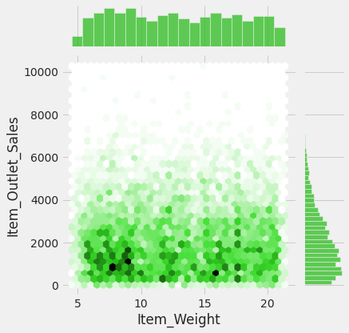
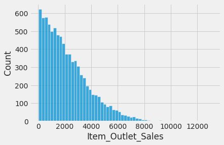
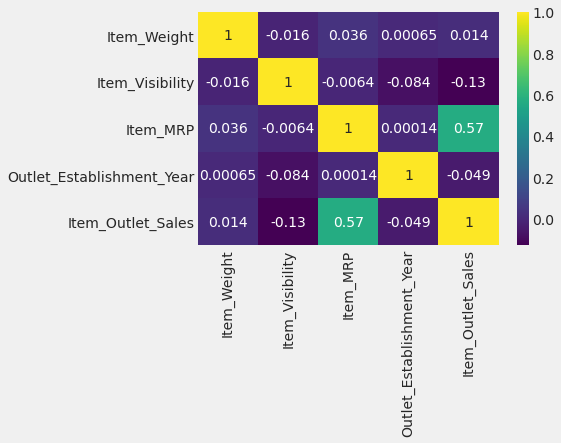

# Streamlit Link
[](https://share.streamlit.io/rohans6/big-mart-sales/main/Main.py)
# Big-Mart-Sales:- Project Overview
* Created a tool that predicts sales of each  product at a big mart outlet to understand the properties of products and outlets that play a key role in increasing sales.
* Analysed the data, handled the missing values, and engineered new features.
* Used Kfold Cross-Validation Strategy, optimized RandomForestRegressor, and LightGbmRegressor using GridSearchCV, and prepared an ensemble of both.
* Build a Web Application using Streamlit.
# Features:-
* Item_Identifier :-Unique Product Id.
* Item_Weight:- Weight of Item.
* Item_Fat_Content:- Fat Content of Item.
* Item Visibility:- The % of the total display area of all products in a store allocated to the particular product.
* Item_Type:-	The category to which the product belongs.
* Item_MRP:-	Maximum Retail Price (list price) of the product.
* Outlet_Identifier:-	Unique store ID.
* Outlet_Establishment_Year:-	The year in which store was established.
* Outlet_Size:-	The size of the store in terms of ground area covered.
* Outlet_Location_Type:-	The type of city in which the store is located.
* Outlet_Type:-	Whether the outlet is just a grocery store or some sort of supermarket.
* Item_Outlet_Sales:-	Sales of the product in the particular store. This is the outcome variable to be predicted.

# EDA:-
I looked at distributions of variables, hexagonal-binning-plots to understand relationships between different numerical features, pivot tables to understand relationships between
categorical-features, Heatmaps.
Here are some plots from the analysis:-




Following are the main remarks of this stage:-
* It was noted that the missing values exhibited a random pattern (MCAR - Missing Completely At Random). Consequently, these missing values were filled using either the mean or median, depending on the distribution of the respective variable. Additionally, certain instances have an item visibility recorded as 0, which is implausible. It is conceivable that these instances may represent missing values encoded as zeros.
  
* Additionally, certain instances have an item visibility recorded as 0, which is implausible. It is conceivable that these instances may represent missing values encoded as zeros.


# Feature Engineering
* Imputed Missing Values with a mean value of that price for that item
e.g 
```
item_avg_weight=all_data.pivot_table(values="Item_Weight",index="Item_Identifier")
all_data.loc[all_data['Item_Weight'].isnull(),"Item_Weight"]=all_data.loc[all_data['Item_Weight'].isnull(),"Item_Identifier"].apply(lambda x: item_avg_weight.loc[item_avg_weight.index==x,"Item_Weight"][0])
```
* A new feature is generated based on the product ID, categorizing products as either food, beverage, or non-consumable.
* RobustScaler was applied to numerical attributes, while categorical attributes were subjected to OneHotEncoding.

# Performance Metric
RMSE:-Root Mean Squared Error.
# Model Building
Scaled Numerical features with RobustScaler to avoid the influence of outliers, OnehotEncoding for categorical features as there are no ordinal features  using ColumnTransformer
```
ColumnTransformer([("Numerical",RobustScaler(),num_cols),("Categorical",OneHotEncoder(handle_unknown="ignore"),cat_cols)])
```

I tried 2 different models and used Kfold Cross Validation:-
* RandomForestRegressor
* LightGBMRegressor

GridSearchCV was utilized to identify the parameter combinations that result in the lowest Root Mean Squared Error (RMSE) for both the RandomForestModel and the LightGBM model.

I made an ensemble of RandomForest and LightGBMRegressor using this code

```
weights=np.arange(0.01,1,0.01)
all=[]
min_error=10000
for w in weights:
    p=w*rf_val_predictions+(1-w)*lgm_val_predictions
    e=np.sqrt(mean_squared_error(y,p))
    if e<min_error:
        min_error=e
        best_weight=w 
```
# Model Evaluation
* RandomForestRegressor RMSE:- 1082.37
* LightGBMRegressor:-1079.0815840228224
* Ensemble of Both:- 1078.4008095223408

# Deployment
Build a Web Application using Streamlit showing every minute detail of the project and perform predictions.


